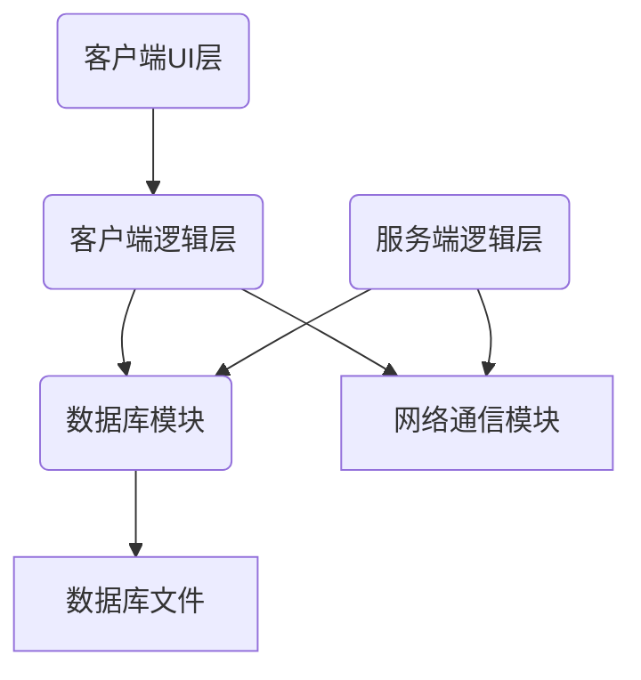
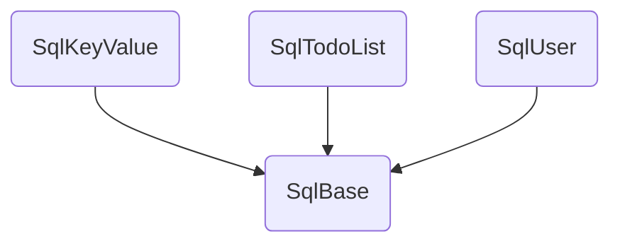

# deltaNote客户端

[客户端使用指南](https://www.notion.so/delta1037/e4ae064f63394961a31a5a12818a3ac0)

## 客户端重构架构设计

-   日志模块：用于日志打印
-   数据库模块：基于SQLite3，用于客户端、服务端数据存储
-   网络通信模块：基于C++的HTTP库，传输json格式的数据
-   客户端：
    -   逻辑层：数据管理、配置管理、同步模块、提醒模块
    -   界面层：主界面、列表组件、列表项、列表项详细内容，设置界面、新建用户界面、颜色选择界面，通知界面，检查更新界面
-   服务端：
    -   逻辑层：同步模块，用户管理模块，数据控制模块

### 数据库模块

-   SqlKeyValue：键值对存储，用于用户配置的存储
-   SqlTodoList：TODO列表的存储，客户端操作流、客户端界面列表、服务端操作流的存储
-   SqlUser：服务端用户管理

