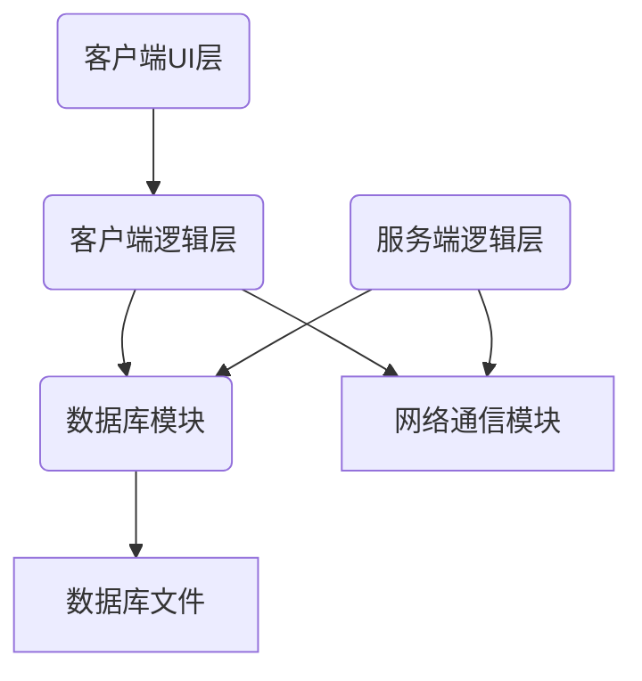
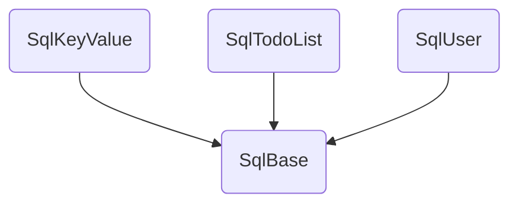

# deltaNote客户端

## 客户端重构架构设计

-   日志模块：用于日志打印
-   数据库模块：基于SQLite3，用于客户端、服务端数据存储
-   网络通信模块：基于C++的HTTP库，传输json格式的数据
-   客户端：
    -   逻辑层：数据管理、配置管理、同步模块、提醒模块
    -   界面层：主界面、列表组件、列表项、列表项详细内容，设置界面、新建用户界面、颜色选择界面，通知界面，检查更新界面
-   服务端：
    -   逻辑层：同步模块，用户管理模块，数据控制模块

### 数据库模块

-   SqlKeyValue：键值对存储，用于用户配置的存储
-   SqlTodoList：TODO列表的存储，客户端操作流、客户端界面列表、服务端操作流的存储
-   SqlUser：服务端用户管理

## 客户端数据流分析
客户端有手动操作和定时操作两类，其中手动的操作之间是不会冲突的，但是手动操作可能会与定时操作之间发生冲突。首先手动操作为修改数据库的OP和UI表，之后读取UI表并更新界面；定时操作为同步OP表，并从OP表生成新的UI表。

对于客户端的刷新操作，分为同步刷新和异步刷新，网络同步和本地同步，可以选择是否等待。首先刷新是不可重入的，也就是说只有一个刷新操作正在进行。

以下为可能发生的冲突记录：

1、当正在进行网络刷新时，由于刷新不可重入，所以此时本地刷新会等待或者直接返回

2、当进行UI操作时，数据库更新完毕前刷新不可进入
